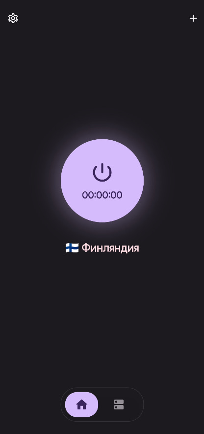
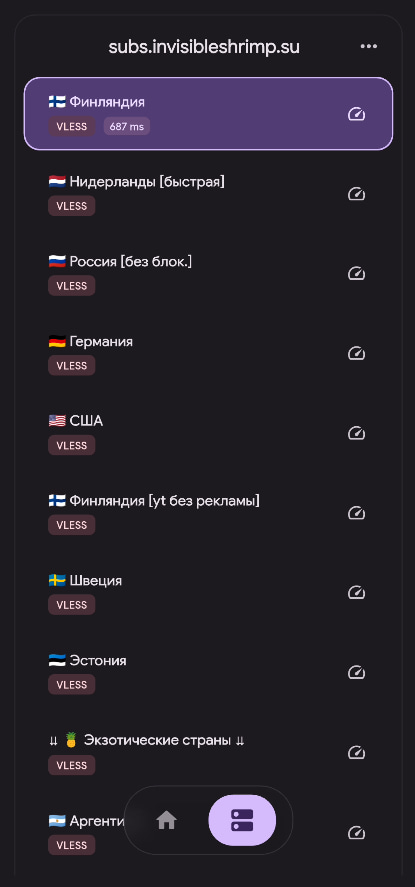
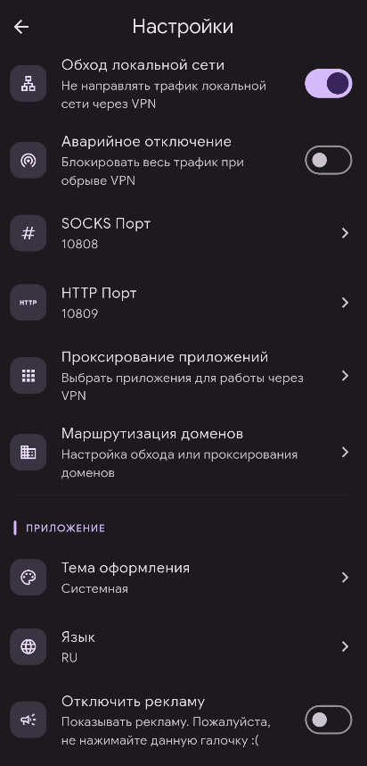

<p align="center">
  <picture>
    <source media="(prefers-color-scheme: dark)" srcset="assets/images/logo.png">
    
  </picture>
</p>

<h3 align="center">Nuxtray</h3>

<p align="center">
  <a href="#features">Features</a> •
  <a href="#supported-protocols">Protocols</a> •
  <a href="#screenshots">Screenshots</a> •
  <a href="#getting-started">Getting Started</a> •
  <a href="#building">Building</a> •
  <a href="#license">License</a> •
  <a href="https://t.me/nuxtray">Telegram</a>
</p>

<p align="center">
  <b>V2Ray / Xray VPN клиент на Flutter</b><br>
</p>

---

## Features

| Feature | Description |
|---|---|
| 🎨 **Material 3 + Monet** | Dynamic colours (Android 12+), dark theme, Google Sans |
| 📡 **Subscriptions** | Add servers via subscription URL or direct config links |
| 🛡️ **Kill Switch** | Blocks all traffic if VPN drops (blackhole outbound injection) |
| 🔄 **Auto-connect** | Automatically connects on app launch |
| 🧩 **Split Tunneling** | Choose which apps go through VPN |
| 🌐 **Domain Routing** | Proxy/direct rules for specific domains |
| 🔌 **SOCKS5 + HTTP** | Configurable local proxy ports |
| ⏭️ **Bypass LAN** | Skip local network traffic |
<!-- | 📱 **Cross-platform** | Android · iOS · Windows · macOS · Linux · Web | -->

## Supported Protocols

```
vless://  vmess://  ss://  trojan://  hysteria2://  hy2://  wireguard://
```

## Screenshots

| Home | Servers | Settings |
|---|---|---|
|  |  |  |

## Getting Started

```bash
# Clone
git clone https://github.com/gloomy-qmark/nuxtray.git
cd nuxtray

# Get dependencies
flutter pub get

# Run
flutter run
```

> **Note:** Servers are added via subscription — there are no hardcoded servers.  
> Paste a subscription URL (`https://...`) or direct config link (`vless://...`) on the Home screen.

## Building

```bash
# Android APK (signed with your keystore)
flutter build apk
```

### Release signing

1. Create `android/key.properties`:
   ```
   storePassword=your_pass
   keyPassword=your_pass
   keyAlias=upload
   storeFile=../keystore.jks
   ```
2. Place `android/keystore.jks`
3. Build: `flutter build apk --release`

> Both files are in `.gitignore` — keep them out of version control.

## Tech Stack

- **State:** `provider` + `ChangeNotifier`
- **VPN engine:** `flutter_v2ray_plus`
- **Theming:** `dynamic_color` (Monet) + `google_fonts`

<!-- ## License

```
``` -->

---

<p align="center">
  <sub>Built with Flutter · Powered by V2Ray / Xray</sub>
</p>
